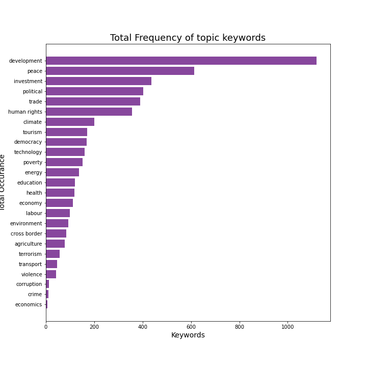

# NLP-based-Discourse-Analysis-of-Speeches-by-Ministry-of-Foreign-Affairs-Nepal

so in this project we have aimed to analyze transcripts of speeches from <b>Ministry of Foreign Affair, Nepal</b>. The main goal of this project is to find critical discourses in the speeches. For this we have performed topic modeling to find hidden topics and some text analytics.  

some of the plots obtained from analysis of speeches are given below:  

  
